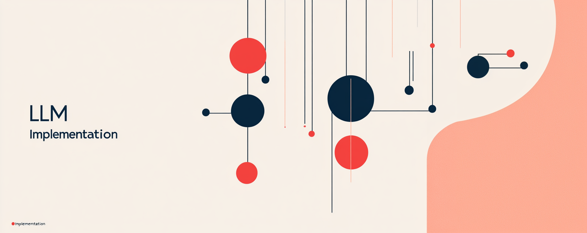

# Practical-LLM-Fine-Tuning

Practical code examples and tutorials for fine-tuning various Large Language Models. Companion repo for YouTube guides.

Hi! Welcome to the companion repository for the **LLM Implementation** YouTube channel www.youtube.com/@LLMImplementation. Here, I share code, notebooks, and resources related to my learnings and practical experiences in LLM implementation, including tutorials and project explorations focused specifically on **fine-tuning**.

Fine-tuning allows you to adapt powerful pre-trained LLMs like Google Gemini, Llama, Mistral, and others to your specific tasks, domains, or desired output styles, often achieving better results than prompting alone. This repository contains hands-on examples exploring various fine-tuning techniques and models.

## Models & Examples

This repository is organized by model type:

### 1. Google Gemini

* **Folder:** [`gemini/`](./gemini/)
* **Description:** Examples focusing on fine-tuning Google's Gemini family of models, often utilizing Google Cloud Vertex AI.
* **Current Examples:**
    * **[Supervised Fine-Tuning to Humanize Prompts](./gemini/supervised_humanizing_prompts/)**: Demonstrates data preparation (JSONL) and the process for supervised tuning on Vertex AI. *(Companion to: [Practical Gemini Fine-Tuning: Step-by-Step Guide with Vertex AI](https://youtu.be/MOaHlowhp8s))*

### (More models and techniques to be added!)

## Contributing

I'm sharing my learning journey here! If you find bugs, have suggestions for improvements, spot errors, or want to discuss ideas related to fine-tuning, feel free to open an issue. Pull requests that fix issues or add value are also welcome.

## License

This project is licensed under the [MIT License](./LICENSE). *(Assumes you chose the MIT License based on our discussion)*

---

Let's learn and explore LLM fine-tuning together! Don't forget to check out the www.youtube.com/@LLMImplementation for video walkthroughs and discussions.